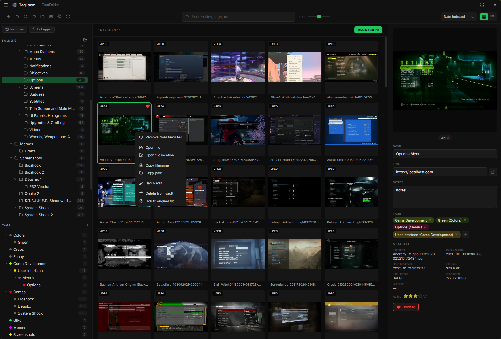

<h1>
  
  TagLoom - Simple multimedia tagging/library management app
</h1>
<p align="center">


<br><br>
</p>

**TagLoom** is a desktop multimedia tagging and library management application for images, videos, and GIFs.
It indexes existing folders (vaults) without modifying any original files — all metadata and thumbnails live inside a `.tagloom/` directory.



> [!NOTE]
> This project is still in alpha state and is provided "AS IS". Some functionality might be changed or may not work as expected

## Features

- **Non-Destructive Vault System** - Index any folder without modifying original files; all metadata lives in `.tagloom/`
- **High Performance** - Thousands of files per vault, fast search and switch vaults, ~18MB executable
- **Full-Text Search** - Real-time FTS5 search across filenames, names, notes, and tags
- **Hierarchical Tagging** - Color-coded parent/child tags with aliases
- **Rich Metadata** - Editable name, notes, links, star ratings, and favorites, plus read-only EXIF, resolution, and video duration
- **Grid & List Views** - Adjustable thumbnail sizes with multi-select and full-size preview
- **Composable Filtering** - Combine folder, tags, rating, and favorite filters
- **Flexible Sorting** - By date, filename, name, size, or rating (ascending/descending)
- **Batch Editing** - Apply tags, ratings, or favorites across multiple selected files
- **Keyboard Shortcuts** - Ctrl+F search, Ctrl+R re-scan, Ctrl+D favorite, ←/→ navigate, and more

## How to

### Download and install

- Select and download the .exe installer from GitHub Releases and follow the wizard
- Or download the standalone `.exe`, place it anywhere, and run it directly

### Use

#### First steps

1. **Create a Vault (+ icon)** - select any folder on disk. TagLoom creates `.tagloom/` folder inside it and starts scanning

    - You can select folders to exclude
    - You can select thumbnail image quality
2. **Browse your files** - use the gallery (grid/list) to navigate your media
3. **Search** - type in the search bar to find files by name, notes, or tags
4. **Tag files** - select a file, then add/edit tags in the right panel, right click on a folder to batch edit files in it
5. **Organize** - use the folder tree and tag tree in the left panel to filter your view
6. **Preview** - select a file to see small preview on right panel, double click to open fullscreen preview
7. **Edit tags** - right click on a tag in left panel to edit it

#### Shortcuts

- `Ctrl+A`    - Select all files matching current filters
- `Ctrl+B`    - Open batch edit modal for selected items
- `Ctrl+C`   - Copy original image to clipboard, if possible (single selection)
- `Ctrl+F`    - Focus search bar
- `Ctrl+R`    - Rescan the vault
- `Ctrl+D`    - Toggle favorite on selected file(s)
- `Enter`     - Open preview (same as double-click on thumbnail)
- `Escape`    - Close open modals (priority order), then clear selection, unfocus from search bar
- `← / →`     - Navigate gallery (previous / next file)

### Build

#### Prerequisites

1. Go (1.25+)
   - Download from https://go.dev/dl/
   - Install and ensure **Go** is on your PATH
2. Node.js (16+)
   - Download from https://nodejs.org/ (LTS recommended)
   - Ensure node and npm are on your PATH
3. FFmpeg (required at runtime)
   - Download from https://ffmpeg.org/download.html

#### Build steps

1. Clone the repository

    ```bash
    git clone https://github.com/Synmik/TagLoom
    ```

2. Install Go dependencies

    ```bash
    go mod download
    ```

3. Install frontend dependencies

    ```bash
    cd frontend
    npm install
    cd ..
    ```

4. Development mode

    ```bash
    wails dev
    ```

5. Build mode

    ```bash
    wails build
    ```

Outputs to bin/ directory: `bin/TagLoom.exe` — standalone Windows executable

## Supported formats

### Image formats

`JPEG`, `JPG`, `PNG`, `WEBP`, `AVIF`, `GIF`, `BMP`, `SVG`, `TIF`, `TIFF`, `JPEGXL`, `JXL`

### Video formats

`MP4`, `MOV`, `AVI`, `WEBM`, `MKV`, `WMV`, `FLV`, `M4V`, `3GP`, `3G2`, `VOB`, `OGV`, `MPG`, `MPEG`, `M2V`, `TS`, `MTS`, `M2TS`, `ASF`, `RM`, `AMV`, `F4V`, `DV`, `MXF`

## Roadmap

- [ ] More file types support
- [ ] More tag types
- [ ] More customization for tags
- [ ] More filters
- [ ] Convert images
- [ ] Folders to tags feature
- [ ] Auto-index new files
- [ ] Dark / light theme toggle
- [ ] Option to exclude file types from indexing
